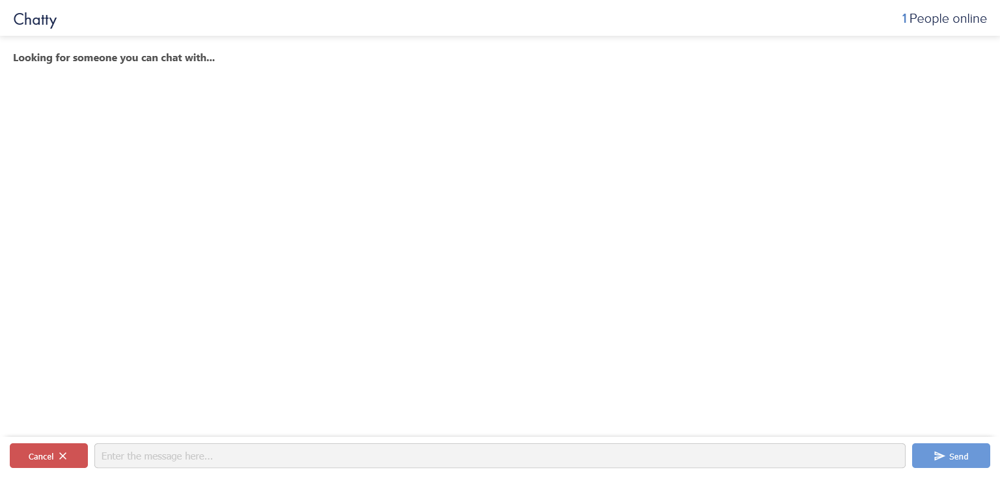
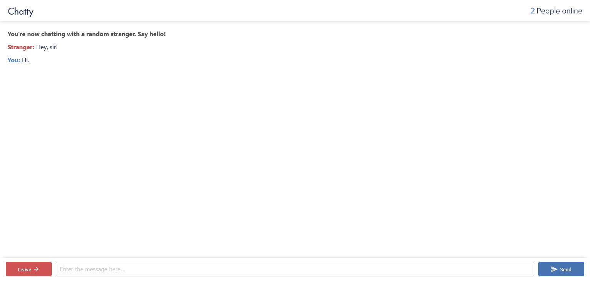

# Chatty - lightweight and efficient clone of omegle.com

Chatty is based on Omegle.com. Omegle is randomly pairing you one-on-one with a stranger and letting you comfortably chat with him. Also, if you got bored by chatting with stranger, you can easily find other stranger to chat with. 

This clone might be not as good as it could be because I created it for learning purposes.

## Screenshots

## Prerequisites

You will need the following things properly installed on your computer.

* **[Git](https://git-scm.com/)** - Git is a version control system which helps in tracking changes in files and also in coordinating with number of people on same project.
* **[Node.js](https://nodejs.org/)** *(node v16.5.0)* *(with NPM v7.20.0)* - Node.js is a JavaScript runtime which is built on the top of chrome's v8 JavaScript engine. You can install Node.js easily with [nvm](https://github.com/creationix/nvm).

## Installation

* `git clone <repository-url>` this repository
* `cd Chatty`
* `npm install` - This will install all the npm packages that are needed.

## Running

* `node index`
* Visit your app at [http://localhost:3000](http://localhost:3000).

Enjoy! :)

